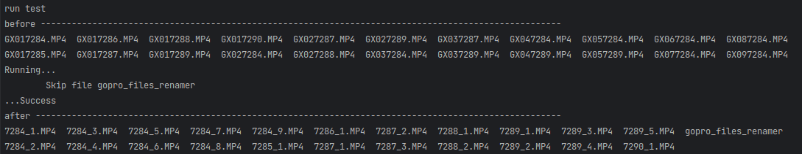

## gopro_files_renamer

Скрипт для переименовывания видео файлов, выгруженных из `gopro`

Принцип его работы видно на скриншоте. 
В результате получаются файлы с названием типа `<номер_видео>_<часть_видео>.MP4`

Это позволяет смотреть видео именно в том порядке, в котором они были записаны. 
Так же это немного упрощает видеомонтаж за счет более удобной навигации по исходникам

### Как использовать

1. Загрузить исполняемый файл в зависимости от системы (linux/windows)
2. Положить загруженный файл его в директорию с выгруженными видео
3. Запустить скрипт, игнорируя предупреждение системы (если не уверены, то всегда можно посмотреть исходники и скомпилировать самому `go build`)
